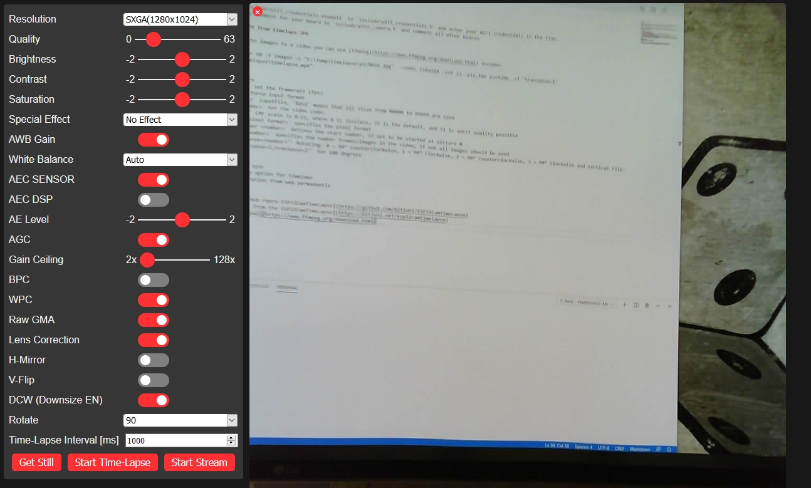

# ESP32 Timelapse / Webcam

ESP32 Cam project for timelapse and streaming.

The project was started with the code of [bitluni/ESP32CamTimeLapse](https://github.com/bitluni/ESP32CamTimeLapse).



## Functions

* Webpage
* Rotate Img / Stream
* Changed values are saved permanently
* To reset saved settings to default use webpage or restart ESP32 twice within 10 seconds

## Configure

* Rename `include\wifi_credentials.example` to `include\wifi_credentials.h` and enter your WiFi credentials in the file.
* Remove the comment for your board in `include\pins_camera.h` and comment all other boards

## Create MP4 from timelapse JPG

Converting the images to a video you can use [ffmpeg](https://www.ffmpeg.org/download.html) encoder.
```
ffmpeg.exe -r 60 -f image2 -i "C:\Temp\timelapse\pic%05d.jpg"  -codec libx264 -crf 23 -pix_fmt yuv420p -vf "transpose=1" "C:\Temp\timelapse\timelapse.mp4"
```

### Parameters 
* `-r <rate>` set the framerate (fps)
* `-f <fmt>` force input format
* `-i <infile>` inputfile, `%05d` means that all files from 00000 to 99999 are used
* `-codec <codec>` Set the video codec
* `-crf <crf>` CRF scale is 0–51, where 0 is lossless, 23 is the default, and 51 is worst quality possible
* `-pix_fmt <pixel format>` specifies the pixel format
* `-start_number <number>` defines the start number, if not to be started at picture 0
* `-vframes <number>` specifies the number frames/images in the video, if not all images should be used
* `-vf "transpose=<number>"` Rotating: 0 = 90° Counterclockwise, 1 = 90° Clockwise, 2 = 90° Counterclockwise, 3 = 90° Clockwise and Vertical Flip. Use `-vf "transpose=2,transpose=2"` for 180 degrees

## ToDO
* Add NTP time sync

## Links
* [Original GitHub repro ESP32CamTimeLapse](https://github.com/bitluni/ESP32CamTimeLapse)
* [Project page from the ESP32CamTimeLapse](https://bitluni.net/esp32camtimelapse)
* [FFmpeg download](https://www.ffmpeg.org/download.html)